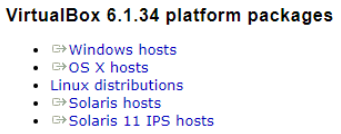
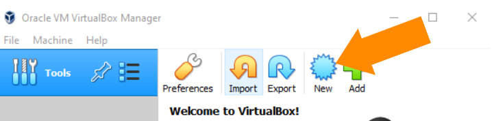
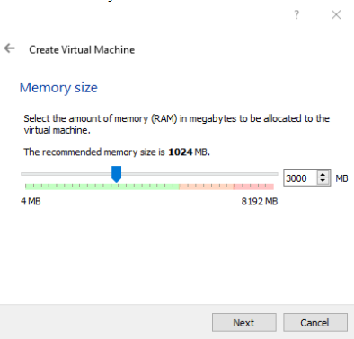
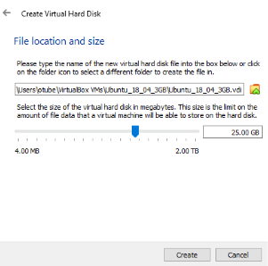
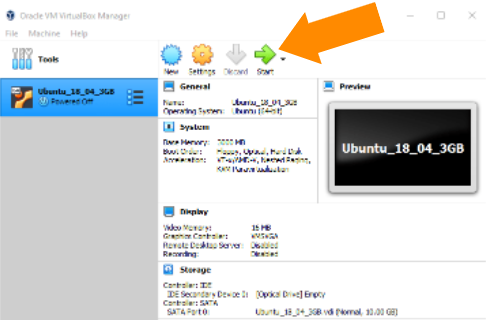
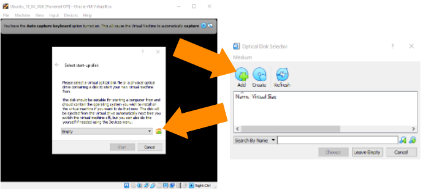
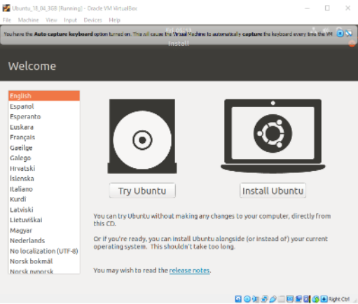
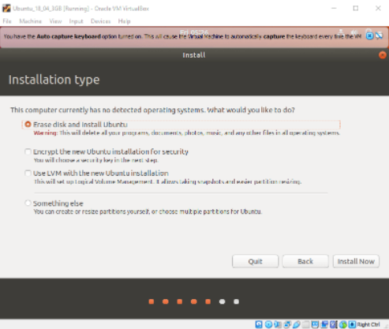
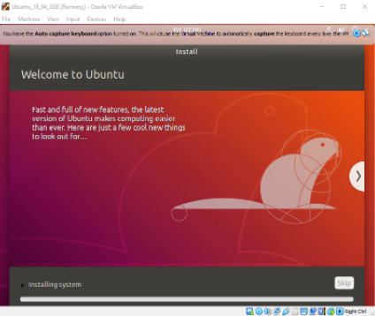
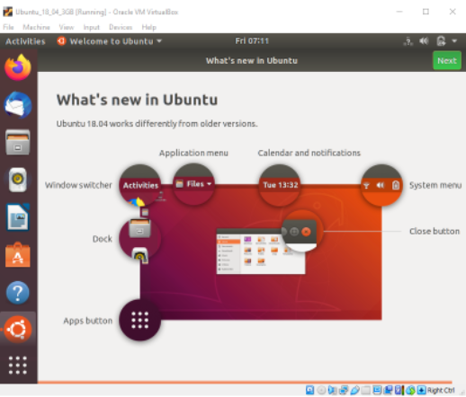

# Workshop Zero - *Getting Set Up with Linux / Ubuntu*

Welcome to the first worksheet in our series "Intro to Robotics Programming with ROS and Linux". For all workshops in this series we will be utilizing the Ubuntu operating system, inarguably the most user friendly and most common Linux [distribution][1] \[1].
The aim of this worksheet is to get you set up in a Linux OS such that we can hit the ground running in subsequently events. The motivations for using Linux and ROS will be outlined in the next workshop, so for now just follow the instructions :).

___

## Installation Options

There are in general 3 options to set up a Linux OS on your own PC:

1. Running the OS in a virtual machine (permits running Linux within an application on your base OS - eg. Windows or MacOS)
2. Setting up for PC for a dual boot (configure your PC to be able to run Ubuntu alongside your base OS, selecting either on system boot)
3. Full install (wipe your PC and install a fresh Ubuntu image)

If you've spent your life in Windows and are new to robotics and Linux we recommend **option 1**. Running Linux in a Virtual Machine is a risk free way to get your feet wet with the command line and ROS, and you can always do a more permanent install later. We recommend **option 2** for those who are certain they'll need a Linux OS for future academic or project work, but want to retain their other OS for its applications like the Microsoft Office / Adobe suite or for gaming. If your Windows license is soon to run out and you're unwilling to pay the big bucks, or you have an old PC lying around thats too slow to run a newer Windows version, we recommend **option 3**. Linux based operating systems are much lighter in general, and this can be a great way to bring an old PC back to life.

___

## Software Decisions

For running Ubuntu in a VM, we are using the *free* virtualizer application [VirtualBox][2] \[2]. With this application you can either load up a pre-made Ubuntu image (or any disk image) *or* configure your own, the process of each is outlined below.

We have decided on **Ubuntu 20.04 LTS** as our chosen Linux distro. 22.04 has recently come out but the Humble Hawksbill ROS2 distribution (*latest ROS2 release*) is the only release primarily targeting 22.04, and comes out on the 23.05.2022. Its often worth waiting some time for new releases to run around in the wild before relying on them yourself, permitting time for open source contributors to adapt their ROS2 software packages to updates in the core stack. I imagine that by 2023 most of the robotics community using ROS2 will be using Humble Hawksbill and Ubuntu 22.04, as it is an LTS release promising 5 years of active support.

___

## Setup Ubuntu in a Virtual Machine

Lets start by outlining some useful terminology:

> **Host operating system (host OS)**: This is the primary OS on the PC you're using, on which you will install the virtualizer application.
>
> **Guest operating system (guest OS):** This is the OS that is running inside the
virtual machine managed by the virtualizer, which in our case will be Ubuntu 20.04.
>
> **Virtual machine (VM):** This is the special environment that Oracle VM VirtualBox
creates for your guest OS while it is running. In other words, you run your guest OS
in a VM. Normally, a VM is shown as a window on your computer's desktop.

We provide 2 sets of instructions for getting Ubuntu running in a VM. Set one will show you how to load up a pre-configured image in the VM, ie VM that already has Ubuntu installed and a user account set up. Set two provides instructions on how to set up your own VM using a fresh Ubuntu image.

### Harware requirements

What your system needs to run Ubuntu effectively in a VM:

- \>8gb RAM. When the guest OS is running we'll permit it to use 4gb, leaving enough memory for the host OS to run its own apps efficiently in the background. If your PC has 16gb available then we recommend configuring the VM to use 8gb.
- \>30gb of free hard disk space. We'll permit the guest OS to use 25gb of this, with the remainder for the Ubuntu base image and VirtualBox related files we'll soon download.

> Note: The following instructions were developed for a Windows 10 env, but should be similar to the process in MacOS and older Windows versions. If not then google is your best mate!

### Loading the Pre-configured Image

1. Download the 3.5GB Virtual Box storage zip file [here](https://drive.google.com/file/d/1HmA8SWFoNap_30brhv7R95Ctwjqv5JDw/view?usp=sharing), and extract/unzip to a known location.

2. Download Virtual Box using the instructions below, launch the application.

3. In the top left corner open 'Machine->Add'.

4. Navigate to the downloaded folder and select the file of type 'Virtual Box Definition' and click Open.

5. The machine is configured to use max 4gb of host RAM. You can increase this in 'Settings->System->Base Memory'. We recommend using half of your systems available memory.

6. Start the VM. The login details are as follows:

```text
User Info:

Computer name: robotics-irl
Username:      student
Password:      robots
```

### Set Up Your Own Virtual Machine with Base Image

#### Download Ubuntu 20.04

1. Download a fresh Ubuntu image from the [releases][3] \[3] page.
   - The image is around 3gb, so feel free to move on to the next steps while you wait for the download to finish.

#### Download and Install Virtual Box

1. Download Virtual Box
    - Visit [https://www.virtualbox.org/wiki/Downloads][4]
    - Choose your host operating system (if your PC is currently running Windows select Windows)

        
2. Follow the install instructions, pressing next on each page. The default options are fine.
    - Click finish to end the process and start the application.

#### Create Virtual Machine

1. Launch VirtualBox and select *New* to start the VM creation process
   
2. Set *Type*='Linux' and *Version*='Ubuntu (64-bit)
    - Choose a descriptive name, something like 'Ubuntu_20_04_4gb'.
3. Set the amount of RAM the guest OS is permitted to use. We recommend using half or 2 thirds of the systems available RAM. Anything less than 4gb will result in pretty sluggish performance within the VM, especially frustrating when we start getting to more robotics related tasks.

    
4. Select option *Create a virtual hard disk*.
5. Select option *VDI (VirtualBox Disk Image*.
6. Select option *Dynamically allocated*.
7. Set hard disk file size to 25 GB.

    

#### Install Ubuntu on Virtual Machine

What you have done so far is create a virtual machine, think of it as a brand new PC, with the memory and resource constraints you have set previously. This new PC does not have any OS installed on it yet, this is the goal of our next step.

1. After creating your VM, you should see the following. Select 'Start' to boot the VM and begin the installation process.

    
2. The following pop up window should appear. This window asks for the location of your downloaded Ubuntu ISO image. Click the folder to open the Optical Disk selector. Select 'Add' to search for your image.

   
3. After selecting *Start*, the machine will boot into the provided image.
4. The following steps are just standard Ubuntu setup. They would be the same were you booting via a USB with the goal of a full install or setting up a dual boot. Start by selecting 'Install Ubuntu'.

   
5. Choose a keyboard layout
6. Since we're a bit memory constrained, select 'Minimal Installation'. You can always install missing applications later, but 'minimal' is sufficient for this workshop. Select also 'Download updates while installing'.
7. Select 'erase disk and install Ubuntu'. Don't worry, this won't wipe the files on the host. It's a VM! Click 'Install Now'

   
8. Select 'Continue' on the 'Write the changes to disks?' window.
9. Set your username and password. These can all be changed later. In the pre-configured image we've provided, we set the following:
    - **your name:** Student
    - **computer's name:** robotics-irl
    - **username:** student
10. Ubuntu is now installing. Keep your PC charging.
   
11. Once finished, select 'Restart Now'
12. If all goes well you should see the following welcome screen after reboot.
    
13. You're now free to explore. Note that when seeking to power down the VM (through closing the window), you have 3 options available.
    - Save machine state: This takes a snapshot of the guest system as it stands at the time of the shutdown request. Meaning that if you have applications open their state will be unchanged when you restart later.
    - Send the shutdown signal: This tells the VM to shutdown via the guest OS's functionality. Equivalent to selecting Power Off in the top right corner while in Ubuntu.
    - Power off the machine: Equivalent to holding down the power button on a PC, triggering a hard shutdown.

___

## Dual Boot

To dual boot your system, we recommend following the instructions [here][5] \[5]. Just remember to back up the files on your current OS to an SSD. The process can seem difficult (or dangerous), but just take your time and utilize a search tool to gain more clarity on each step. We recommend [Ubuntu 20.04](https://releases.ubuntu.com/20.04/).

___

## Full Install

A full install wipes your PC entirely of your original OS and all its data. For this, we recommend these [instructions][6].

___

## Next Steps

Now that you should be up and running within a Linux OS, its time to run free. In the next workshop we'll try and convince you why this is the place to be, even if you're not interested in Robotics, although we hope you are.

The next workshop will focus on the directory architecture of the Ubuntu OS, getting familiar with the terminal and of course some of the more common command line tools.

___

## References

[1]: https://pediaa.com/difference-between-linux-and-ubuntu/
[2]: https://www.virtualbox.org/manual/UserManual.html#virt-why-useful
[3]: https://releases.ubuntu.com/20.04/ubuntu-20.04.3-desktop-amd64.iso
[4]: https://www.virtualbox.org/wiki/Downloads
[5]: https://itsfoss.com/install-ubuntu-1404-dual-boot-mode-windows-8-81-uefi/
[6]: https://ubuntu.com/tutorials/install-ubuntu-desktop#1-overview

\[1]: [https://pediaa.com/difference-between-linux-and-ubuntu/](https://pediaa.com/difference-between-linux-and-ubuntu/)

\[2]: [https://www.virtualbox.org/manual/UserManual.html#virt-why-useful](https://www.virtualbox.org/manual/UserManual.html#virt-why-useful)

\[3]: [https://releases.ubuntu.com/20.04/ubuntu-20.04.3-desktop-amd64.iso](https://releases.ubuntu.com/20.04/ubuntu-20.04.3-desktop-amd64.iso)

\[4]: [https://www.virtualbox.org/wiki/Downloads](https://www.virtualbox.org/wiki/Downloads)

\[5]: [https://itsfoss.com/install-ubuntu-1404-dual-boot-mode-windows-8-81-uefi/](https://itsfoss.com/install-ubuntu-1404-dual-boot-mode-windows-8-81-uefi/)
