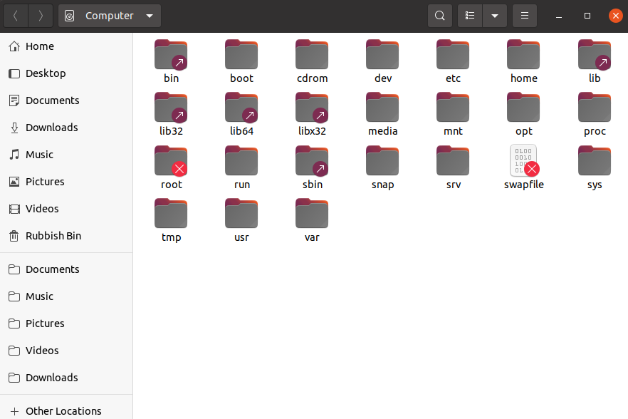
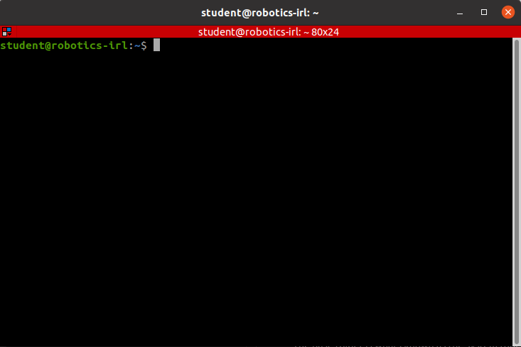
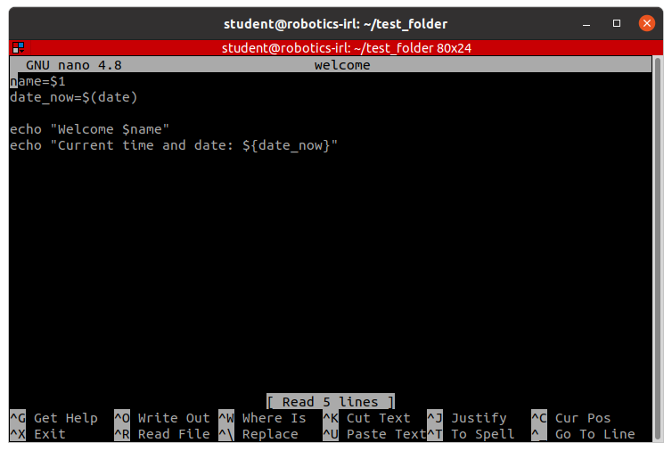
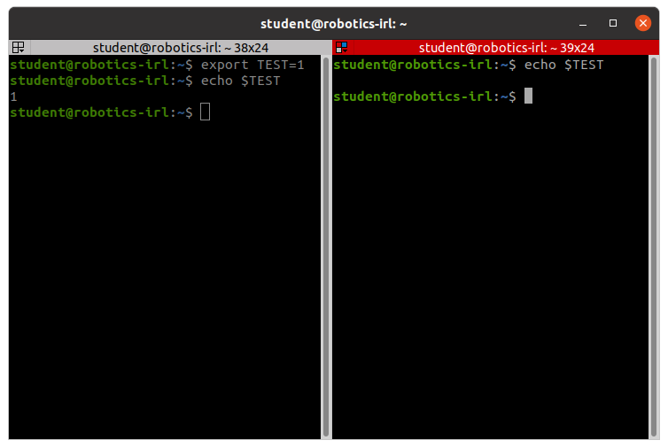
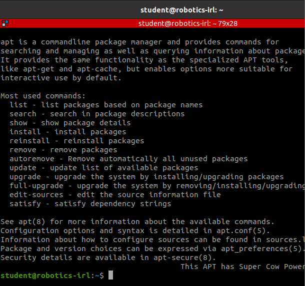
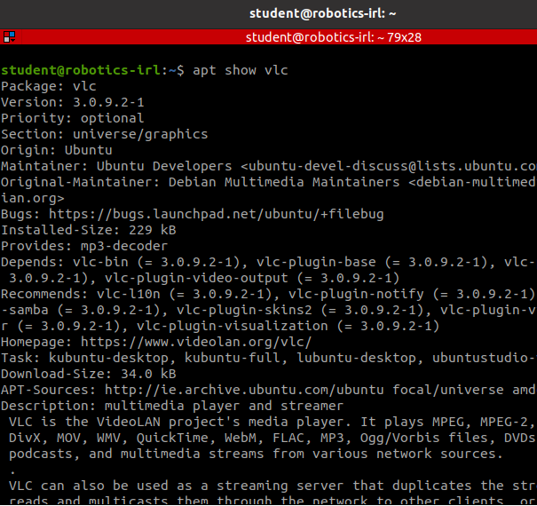
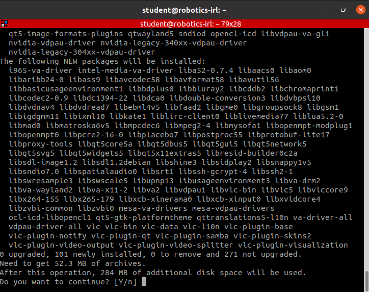

# Into to Linux for Robotics

This worksheet covers some of the core concepts and naming conventions used in Linux based operating systems. We run through the most frequently used command line tools for directory navigation, manipulation and file creation. The primary goal of this tutorial is to get you to a stage where you're comfortable with forming search engine queries and parsing the results for help on a certain task. After spending some time working with the command line you'll find that a lot of the commands you use are typed out seemingly autonomously. Navigating a directory or copying a file no longer feels like typing out a series of bizarre names but becomes something as effortless as touch typing. Nonetheless there will always be some things you can't recall immediately or some process that can be performed more efficiently, in which case a search engine is your best friend. We hope that through this worksheet you'll have enough knowhow to continue experimenting and exploring more independently, without fear of wiping your system. (**NB:** you should back up your work regularly).

## Workspace Setup

Get setup in an Ubuntu environment via the instructions [here](../workshop0/Setup.md). We are using Ubuntu 20.04.

---

## File and Folder layout on a Unix system

Lets examine the standard unix folder structure, from the top down. This structure is defined as a [standard](https://refspecs.linuxfoundation.org/FHS_3.0/fhs/index.html) for Linux and unix-based operating systems.

Navigate to the top directory visually via clicking on the "Files" icon in the _favorites_ toolbar on the left of the screen. Open _+ Other Locations_ followed by _Computer_.


The base folder is whats known as the system root directory. We'll now define the properties and contents of some of the subfolders in this directory.

| Name  | Properties                                                                         | Example                                                          |
| ----- | ---------------------------------------------------------------------------------- | ---------------------------------------------------------------- |
| /boot | Files needed to boot the system                                                    | linux kernel                                                     |
| /dev  | Device files (in unix systems everything is a file)                                | sda - first drive detected                                       |
| /etc  | System configuration files                                                         | hosts - IP's and addresses for local host etc                    |
| /home | User specific files and folders, one for each user                                 | _student's_ (your) files and data such as code and study notes   |
| /opt  | Subfolders for optional packages, that don't have structure defined by the FHS     | All ROS-related shared libraries and executables                 |
| /proc | Files representing system and process info                                         | cpuinfo                                                          |
| /root | Personal files and folders for the root user, the super user / sysadmin            | similar to above                                                 |
| /usr  | Applications and libraries installed by any user. These are shared across by users | /usr/bin contains executables for basic OS use and bash commands |

## Terminal and the shell

Up till now we've navigated the system root directory visually via the file explorer. We'll now motivate the use of the command line for faster navigation, file creation and more.

Lets first open the terminal using the `Ctrl+Alt+T`, you should see the following window pop up:



The terminal is a graphical window that lets you interact with the _Shell_.

_Side note:_
We have installed _Terminator_ and set it as the default terminal interface application. We have already installed this on the pre-configured VM, but you can install it also via `sudo apt install terminator`, the contents of which are explained later in this tutorial.

The Shell is a textual (command line) interface to an operating systems applications and eventually the applications you will write. Every OS ships with a default shell; Powershell in Windows and the Bourne Again Shell (bash) on Linux/Mac platforms, which are similar in principal but have available to them different default commands for navigation and file manipulation.

Lets examine the text printed on the terminal:
`student@robotics-irl:~$`
This is known as the _prompt_. This prompt tells you that you are user _student_ on machine _robotics-irl_. Both of these were defined when we set up the VM. The _~_ is shorthand for _home_, meaning you are currently in the home or base directory of user _student_. Finally, the _$_ shows that you currently don't have root privileges, meaning commands that you run now will not be run as the superuser.

## Navigating and Examining Folders

Lets start running through a few commands

```bash
student@robotics-irl:~$ ls # Show the contents of the current working directory
student@robotics-irl:~$ ls -a # Above plus hidden folders or files (prefixed by .)
```

Feel free to confirm the terminal output with that of the File explorer (it default opens to the user's home directory)

After running `ls -a` you will notice two peculiar entries, that of _._ and _.._
With most (all?) Operating Systems, there exists the concept of absolute and relative paths. An absolute path to a file on your system is a _/_ separated list of the folders between said file and the _root_ directory. Absolute paths are prefixed with _/_. A relative path to a file is the path relative to where you currently are now. The directory above where we are now is referred to as _.._, our current directory is _._

Side note: clarify what _home_ directory usually refers to.

Lets put confirm this with some exercises. Knowing that we are in the home directory of the user _student_ what do you think the absolute path of our current working directory is? Run the following to confirm this:

```bash
student@robotics-irl:~$ pwd # prints the absolute path of the current/present working directory
```

As you can see, we're in _/home/student_, otherwise known as the _home_ directory of user _student_. The above is an absolute path, so we can expect the folder _home_ to be in the root directory, which we saw at the start of the tutorial.

In the terminal, we can jump to other directories via the _cd_ (change directory) command. Confirm everything we mentioned above running the commands in the following script.

```bash
student@robotics-irl:~$ pwd
/home/student
student@robotics-irl:~$ cd .. # change into parent directory
student@robotics-irl:/home$ pwd
/home
student@robotics-irl:/home$ ls
student
student@robotics-irl:/home$ cd .. # change into parent directory
student@robotics-irl:/$ pwd # the root directory, also known as /
/
student@robotics-irl:/$ cd /home/student/ # change to your users home directory
student@robotics-irl:~$ cd / # go back to root directory
student@robotics-irl:/$ ls # show contents of root directory
bin   cdrom  etc   lib    lib64   lost+found  mnt  proc  run   snap  sys  usr
boot  dev    home  lib32  libx32  media       opt  root  sbin  srv   tmp  var
student@robotics-irl:/$ cd ~ # same as "cd /home/student"
student@robotics-irl:~$ pwd
/home/student
```

## Creating files and folders

Now that we can navigate around the Ubuntu filesystem, lets start adding our own files to it.

```bash
student@robotics-irl:~$ cd ~ # make sure we are starting from the home directory
student@robotics-irl:~$ mkdir test_folder # create a folder called test_folder in the home directory (ie in the directory we are now in)
student@robotics-irl:~$ cd test_folder
student@robotics-irl:~/test_folder$ touch welcome # create a file called welcome in test_folder
student@robotics-irl:~/test_folder$ ls
welcome
student@robotics-irl:~/test_folder$ cat welcome # print the contents of this file (its empty for now)
```

We first ensure that we are starting from the home directory. Remember, all paths are relative unless the name is prefixed with a _/_. We then create a folder in this directory via the _mkdir_ command. If we wanted to create this folder in the same location but from an alternative working directory, we could instead have given the full absolute path: `mkdir /home/student/test_folder`. Within this folder we create a new and empty file via the _touch_ command. The primary function of _touch_ is to update the "accessed" timestamp of a file, but if the file name given does not already exist it will create a new and empty one. We can confirm this by running _cat_ on the file which prints a file's contents to the terminal.

Lets start adding some content to the file. Open up the file using [Nano](https://help.ubuntu.com/community/Nano), a terminal-based text editor that ships with Ubuntu. Run `nano welcome` to open the file.

We're going to write a bash script that takes as argument a name, and prints it to the terminal along with the current date and time.



In the first line we evaluate the first argument passed to the script and assign its value to a variable called _name_. In the second line we run the _date_ command (the syntax $(function) calls a function and returns its output) and assign its output to variable _date_now_.

The last two lines print our desired output to the console, where the syntax ${var} evaluates the value of a variable with name _var_

Lets save this script via "CTRL+X", "Y", "ENTER".

The syntax we have used in this file is that of the bash language. So to run it as a bash script we enter the following in the terminal:

```bash
bash welcome Atlas
```

While this is purely an academic exercises, scripting is super useful for automating repetitive and boring tasks. Oftentimes the bash language is suboptimal for some of these tasks and it may prove better to rely on a more expressive language like Python, or if speed is key then something like C. ([date](https://github.com/coreutils/coreutils/blob/master/src/date.c) is written in C).

From a user's perspective, its shouldn't matter what language the script is written in, they should just be able to call it without having to specify how it is interpreted. We can tell the linux system that this file is a bash script and therefore should be interpreted as one by adding one additional line to the top of our script

```bash
#!/bin/bash
```

This is whats known as a [shebang](<https://en.wikipedia.org/wiki/Shebang_(Unix)>). And tells the system to call _bash_ from _/usr/bin/bash_. We need now to let the system know that this script can be executed, using [chmod](https://www.howtogeek.com/437958/how-to-use-the-chmod-command-on-linux/):

```bash
chmod +x welcome
```

You can now run the scripts via

```bash
./welcome Atlas
```

The same kind of functionality can just as easily be written in python via:

```python
#!/bin/python3

import sys
from datetime import datetime

name = sys.argv[1]
date_now = datetime.now()

print("Welcome %s" % name)
print("Current time and date: %s" % date_now)
```

Save this file file also and try execute in the same way as above. You'll need to name it to something different to prevent a conflict with the bash script.

For scripts that we want to be able to execute from anywhere, without having to specify the full path (/home/student/test_folder/welcome Atlas), just like we can run _date_ from anywhere, we need to add our script to a known path where Linux can search for executables.

This path is stored as global variable with name _PATH_ and whose value can observed via the script below which is a colon separated list of path to directories containing executable binaries (_bin == binaries / executables_).

```bash
echo $PATH
#/usr/local/sbin:/usr/local/bin:/usr/sbin:/usr/bin:/sbin:/bin:/usr/games:/usr/local/games:/snap/bin
```

We can confirm that the _date_ executable lives in one of the above directories using the _which_ command:

```bash
which date
#/usr/bin/date
```

We want to add the path to our new _welcome_ function to this global variable. There are a few ways in how we could do this.

### Option 1

We could simply copy our file to one of the paths already present in the path variable. _/usr/local/bin_ is the best option for this. But recall that all files installed in the root directory (anything outside of /home) are shared across all users. Therefore it is best practice to not install non-standard user defined scripts in here, unless you're certain all users of your system can avail of it.

### Option 2

We could also add the path _/home/student/test_folder/_ to _PATH_ via the command below, which sets _PATH_ equal to its current value (_$PATH_) plus our new folder in which contains our script.

```bash
PATH=$PATH:~/test_folder/
echo $PATH
#/usr/local/sbin:/usr/local/bin:/usr/sbin:/usr/bin:/sbin:/bin:/usr/games:/usr/local/games:/snap/bin:/home/student/test_folder/
```

This solution is also not ideal. As we get more adventurous (and lazy) we'll start writing more and more scripts to string together commands we're repeatably writing out. Updating _PATH_ each time is a nuisance. Additionally we might want to rename our _test_folder_ example to something more informative, in which case our path set above will become invalid.

### Option 3

The standard solution to aggregating user defined scripts is to put them all in a known folder, namely _~/bin_. It is convenient to add all of our helper scripts to a single location.

Lets create a new directory titled _bin_ in our home directory, copy our script in there, and set the updated PATH. Start by opening a new terminal, then run the following:

```bash
mkdir ~/bin
cp ~/test_folder/welcome bin/
PATH=$PATH:~/bin/
```

The only new thing we've used here is the _cp_ function, with syntax `cp <path/to/file> <path/to/target/folder>`. If we want to copy a folder and its contents to a new location, use `cp -r`.

Confirm that our command works by running our script from multiple different directories.

### Finally

When updating the _PATH_ variable above, we have only done so locally in our terminal session. If we open a new terminal (new session), this update isn't present anymore. You can assess this behavior by opening a new terminal window (Ctrl+Alt+T) and add a second session (Ctrl+Shift+E in Terminator). Below is a screenshot exhibiting the locality of a variable exported in a session:



We would like a setup such that the updated _PATH_ variable is present in all terminal sessions. Introducing the **_~/.bashrc_** file. The bashrc is a bash file that is sourced every time a new terminal is opened. View it with `cat ~/.bashrc`. It contains code for customizing your bash prompt, some preset [aliases](https://linuxize.com/post/how-to-create-bash-aliases/) and more. All you need to do to permanently add _~/bin_ to _PATH_ is to add `PATH=$PATH:~/bin/` to the end of the file. You can even do this without having to open it in _nano_ via the following:

```bash
echo 'PATH=$PATH:~/bin/' >> ~/.bashrc
```

## Other Commonly Used Commands

While not part of the above story, here are a list of other commands used regularly:

**_mv:_** moves a file from one location to another. Also handy for file renaming:

```bash
mv path/to/original.txt new_path/to/original.txt # moves file to new parent folder
mv original.txt new_name.txt # changes file name, moves to new path with same parent structure
```

**_rm:_** deletes a file permanently, use **_rm -r_** to delete a folder. Note that files deleted in such a way are permanently destroyed. Therefor it is recommended to to create a _Trash_ folder in your home directory and use `mv file.txt ~/Trash/` instead.

**_history:_** prints a time ordered list of previously used bash commands. Note you can also press _up, ^_ on the arrow keys to jump through previous commands.

**_man:_** displays the manual for common bash commands, example `man mv`. This manual provides info on the command itself, including a list of possible options (like -r seen previously).

See [here](https://www.educative.io/blog/bash-shell-command-cheat-sheet) for a collection of the 25 most commonly used bash commands.

## sudo

In Linux, access to files, running commands, installing packages and saving changes to code is dependent on your identity as a user and the level of access that user has. Insufficient user access results in being unable to execute certain important commands. User access can be raised to execute commands that require higher permissions or privileges. This is analogous to administration rights on the Windows operating system.

_sudo_ is an acronym and it stands for _superuser do_ or _substitute user do_. Using it will raise your privileges to run commands on the terminal as root or as another user. It allows you to do this without having to log in as admin. It is important to note that the access given through using _sudo_ is only temporary. Hence you will have to use it repeatedly with Linux commands to maintain root access.

_sudo_ is used as a preface to the normal command on a terminal. The following is a sample use of the Linux command. Let's say we wanted to copy our _welcome_ bash script to _/usr/local/bin_. Doing a regular `cp` results in the following:

```bash
cp ~/test_folder/welcome /usr/local/bin
cannot create regular file '/usr/local/bin/welcome': Permission denied
```

The majority of files and folders in the root directory have protected write access, permitted only by the superuser. We can try again using the sudo command, which prefixes the command above:

```bash
sudo cp welcome /usr/local/bin
# enter password ...

# move file to trash to prevent duplication
mkdir ~/Trash # make directory if not already created
sudo mv /usr/local/bin/welcome ~/Trash
```

## Package Managers

Installing software packages on Debian-based systems is done through a high-level command line package manager. It can also be done through a package manager with a GUI such as Synaptic Package Manager and Ubuntu Software Center. With a package manager you can search for shared libraries, prerequisite software and dependencies that are needed for installing a specific software package.

An example package manager is _apt_. Execute the apt command in your terminal as:V

```bash
student@robotics-irl:~$ apt
```

You should see the following on your terminal:



The above outputs a description of the package manager. Here it is shown what are the following commands you can put after calling apt to perform a certain action. This type of information is normally available for most software packages on Ubuntu.

Try executing the following command in your terminal

```bash
student@robotics-irl:~$ apt show vlc
```

You should see the following:



This output names software packages related to the package queried about. It also offers a description to you to inform you about what the software is about. In this case, the package queried about is _vlc_. As mentioned in the output _VLC_ is the VideoLAN project's media player.

If _vlc_ is not yet installed on your computer, you can use _apt-get_ to get it. However, to do this you need to have root-access. Enter the following command in your command line to install, note that you may need to enter your password when queried:

```bash
student@robotics-irl:~$ sudo apt-get install vlc
```

If vlc is not yet installed, you should see the below output:


It is worth noting the packages that are to be installed or removed based on the command when using apt. Here, 0 packages are to be removed and 284 MB of space will be used if you enter Y and press your enter key in your terminal. You want to be careful when apt highlights that a number of packages may be deleted if you run the code.

You can then launch vlc by running the following command:

```bash
student@robotics-irl:~$ vlc
```

## Next Steps

The next steps in this workshop series is to begin learning about Robot Operating System (ROS). Some of the basics of Linux OS have been gone through in this workshop. These basics will be useful to you as you get more comfortable with developing software for a robotics project.

There are still many commands and tricks worth exploring to increase your linux skills. It is a worthy investment to continue to get familiar to the operating system as you develop software. Here are some cheat sheets that you may be useful to you in your journey.

[https://linuxconfig.org/linux-commands-cheat-sheet](https://linuxconfig.org/linux-commands-cheat-sheet)

[https://phoenixnap.com/kb/linux-commands-cheat-sheet](https://phoenixnap.com/kb/linux-commands-cheat-sheet)

[https://medium.com/@snk.nitin/linux-commands-and-cool-tricks-8fe6ac855b06](https://medium.com/@snk.nitin/linux-commands-and-cool-tricks-8fe6ac855b06)

It also is worthwhile to share knowledge between colleagues and friends who are also into Linux and/or Robotics like you are. Peers often have come across very interesting ways of tackling problems they faced as they were getting into Linux Operating systems. So in the spirit of Ubuntu:

> "I am because you are" - the literal translation of the word "Ubuntu"

Help one another out and tap into your humanity as you develop software :)

## Additional Resources

[1]: https://www.pluralsight.com/blog/it-ops/linux-file-permissions
[2]: https://snapcraft.io/blog/a-technical-comparison-between-snaps-and-debs
[3]: https://www.youtube.com/watch?v=iIM0uMOxSYc
[4]: https://missing.csail.mit.edu/2020/course-shell/

\[1]: [https://www.pluralsight.com/blog/it-ops/linux-file-permissions](https://www.pluralsight.com/blog/it-ops/linux-file-permissions)

\[2]: [https://snapcraft.io/blog/a-technical-comparison-between-snaps-and-debs](https://snapcraft.io/blog/a-technical-comparison-between-snaps-and-debs)

\[3]: [Synaptic Package Manager](https://www.youtube.com/watch?v=iIM0uMOxSYc)

\[4]: [MIT Course](https://missing.csail.mit.edu/2020/course-shell/)
